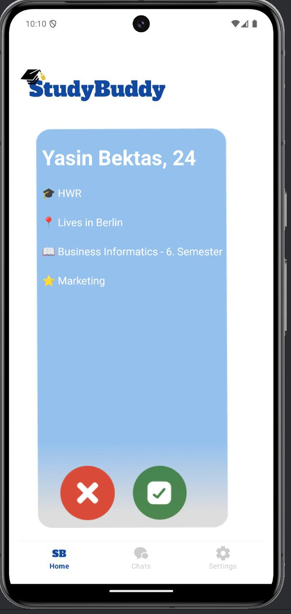
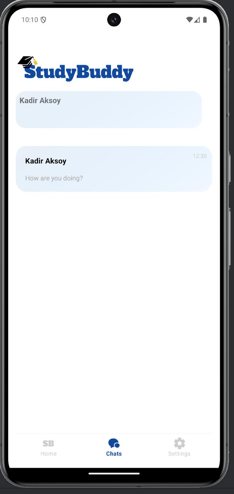
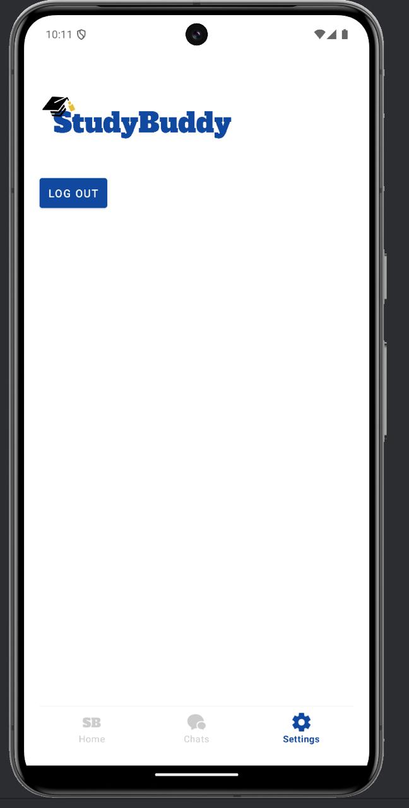

# StudyBuddy Android App

StudyBuddy is a mobile application designed to help students connect, chat, and study together. The app allows users to find study partners, chat in real time, and manage their study interactions seamlessly.

## Features

 **User Authentication**
- Secure login and registration using Firebase Authentication.
- Persistent user sessions.

 **Matching System**
- Users can find and match with study partners based on their shared interests.
- Feature to accept or decline potential study buddies with a like or dislike.

 **Chat Functionality**
- Real-time chat powered by Firebase Firestore.
- Messages display with proper styling (sent messages in light blue, received messages in gray).
- Usernames displayed in chat history.
- Displays the last message for each chat.

 **UI/UX Enhancements**
- Adaptive icons and improved layouts for better user experience.
- Bottom navigation implemented across **Home, Chats, and Settings**.
- Responsive design with proper spacing and styling.

## Installation

1. Clone the repository:
   ```sh
   git clone https://github.com/Can1020/StudyBuddy-Android.git
   ```
2. Open the project in **Android Studio**.
3. Sync Gradle and install dependencies.
4. Set up Firebase:
    - Add **google-services.json** to `app/`.
    - Configure Firebase Authentication & Firestore database.
5. Run the app on an emulator or physical device.

## Firebase Rules
Ensure Firestore security rules are correctly set to prevent unauthorized access:
```c
rules_version = '2';
service cloud.firestore {
  match /databases/{database}/documents {
    match /chats/{chatId} {
      allow read, write: if request.auth != null && request.auth.uid in resource.data.participants;
      match /messages/{messageId} {
        allow read, write: if request.auth != null && request.auth.uid in get(/databases/{database}/documents/chats/{chatId}).data.participants;
      }
    }
    match /matches/{matchId} {
      allow read, write: if request.auth != null && (request.auth.uid == resource.data.userId || request.auth.uid == resource.data.matchedUserId);
    }
  }
}
```

## Technologies Used
- **Java** (Android Development)
- **Firebase Firestore** (Real-time Database)
- **Firebase Authentication** (User Authentication)
- **RecyclerView** (Chat & Matching Lists)
- **Material UI Components** (Navigation & Styling)

## Screenshots
### Home Screen


### Chat Screen


### Settings Screen



## Contributors
- Dzhan Nezhdet (https://github.com/Can1020)
- Kadir Aksoy (https://github.com/KadirAksoy61)


